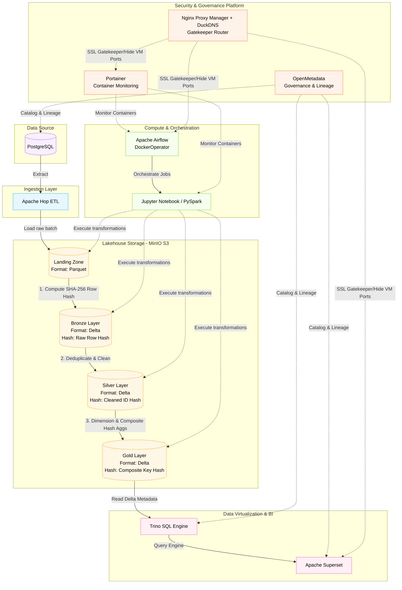

# PySpark - MinIO - Superset Project (Medallion Architecture & Governance)

This repository contains the complete implementation of a modern, robust data engineering pipeline based on the **Medallion Architecture** (Landing ➡️ Bronze ➡️ Silver ➡️ Gold). The project is designed under the concepts of **Infrastructure as Code (IaC)** and **Data Governance**, integrating market-leading tools for data processing, storage, visualization, and metadata cataloging in a fully containerized environment.

---

## 🏗️ Data Flow Architecture and Components

The project is structured around a robust, orchestrated infrastructure where data flows sequentially through the following layers of our Lakehouse in MinIO:




## 🛰️ Lakehouse Layers Breakdown

1. **Source (PostgreSQL):** Transactional data extracted incrementally using temporal filters based on the `modifieddate` control field.
2. **Landing Layer:** First point of contact in the Data Lake (MinIO). Data is saved in the native **Parquet** format to preserve primitive data types and minimize initial write costs.
3. **Bronze Layer:** Raw data from Landing is read by Spark and converted to the **Delta Lake** format, paving the way for ACID transactional operations and versioning (Time Travel).
4. **Silver Layer:** Compliance and quality layer. This is where **Batch Record Deduplication** logic is applied (preventing primary key duplicates using `row_number()`) and the **Delta Merge (Upsert)** is processed. Data is saved partitioned by period column (e.g., `month_key` derived from `modifieddate`).
5. **Gold Layer:** Refined and aggregated business-ready data. To optimize consumption, a hash of the primary keys is maintained with rigorous type handling (generating consistent UUIDs/hashes by applying explicit conversions to prevent `DATATYPE_MISMATCH` errors). The final control date (`dh_atualizacao`) is maintained to ensure traceability and enable quality auditing (Freshness SLA).

---

## 🛠️ Tech Stack & Tooling

* **Data Source:** `PostgreSQL` - Operational relational database.
* **Ingestion Engine:** `Apache Hop` - GUI-driven graphical ETL tool used to perform high-throughput data extraction and initial Landing ingestion.
* **Storage & Lakehouse:** `MinIO (S3 API Compatible)` - Serving as our object storage hosting a Multi-Format Lakehouse (Parquet in **Landing**; Delta Lake in **Bronze, Silver, Gold**).
* **Transformation Engine:** `Apache Spark (PySpark 3.5.0)` - Executed via `Jupyter Notebook` for developing transformations, and run in production using Airflow.
* **Orchestration:** `Apache Airflow` - Manages task dependencies, execution flow, and retries using the `DockerOperator` to trigger isolated tasks.
* **Virtualization & Federated Query:** `Trino` - Fast distributed SQL query engine that reads Delta tables directly from MinIO without data movement.
* **Business Intelligence:** `Apache Superset` - Rich interactive dashboards connected directly to Trino.
* **Governance & Data Catalog:** `OpenMetadata (v3.9+)` - Provides cataloging, schema tracking, column-level lineage mapping, and metadata management across PostgreSQL, Trino, and Superset.
* **Container Management:** `Portainer` - Web GUI dashboard to track resource utilization, logs, and container statuses.
* **Security & Gatekeeper Routing:** `Nginx Proxy Manager (NPM)` & `DuckDNS` - Reverse proxy loop with Let's Encrypt SSL certificates. NPM hides physical virtual machine IPs and direct port bindings, routing custom domain subdomains to services securely over HTTPS.

---

## 🔑 Hashing Strategy & Incremental Merges (Upserts)

To ensure high-performance incremental loads and handle cases where operational databases might duplicate IDs, the architecture enforces **Cryptographic Row-Hashing** across all layers of the Medallion architecture.

### 1. Landing to Bronze: Row-Level State Hash
When raw Parquet files from the Landing Zone are processed into the Bronze layer, we isolate all business-relevant columns and construct a cryptographic SHA-256 fingerprint (`row_hash`). 
To prevent type-signature mismatch errors when hashing integer-based keys (such as `DATATYPE_MISMATCH.UNEXPECTED_INPUT_TYPE`), we cast primary keys to strings before running the expression.

```python
# Isolate business columns (ignoring load timestamps and partition keys)
ignored_columns = {primary_key, "modifieddate", "month_key", "last_update"}
business_columns = [functions.col(c) for c in df_update_data_to_bronze.columns if c not in ignored_columns]

# Concatenate columns with a separator and hash
row_hash_expr = functions.sha2(functions.concat_ws("||", *business_columns), 256)
df_with_hash = df_update_data_to_bronze.withColumn("row_hash", row_hash_expr)
```

### 2. Bronze to Silver: Reusing the Hash Identity
In the Silver layer, the data represents cleaned, standardized, and conformed master structures.

We reuse the primary key and the row_hash generated in the Bronze layer to trace schema lineage.

Updates are merged into Silver tables utilizing PySpark DeltaTable merge APIs:

```python
target_delta_table.alias("target") \\
    .merge(
        source=updates_df.alias("updates"),
        condition="target.id_hash = updates.id_hash"
    ) \\
    .whenMatchedUpdateAll() \\
    .whenNotMatchedInsertAll() \\
    .execute()
```
### 3. Silver to Gold: Granularity Shift & Composite Hashing
The Gold layer represents high-value business aggregates, KPIs, and reporting dimensions/facts.

Dimensional Tables: If the table maintains a 1-to-1 relationship with the business entity, the same hash is propagated to ensure deep lineage.

Fact / Aggregated Tables: Since aggregations alter the record grain (e.g., total sales grouped by customer and month), the individual Bronze row-hashes are no longer valid. Here, we build a Composite Hash generated from the grouping keys (e.g., SHA2(CONCAT_WS('||', customer_id, month_key), 256)) to serve as the new surrogate primary key in the Gold layer.

---

## 🔒 Security & DNS Isolation
We employ a secure reverse proxy design to prevent exposing backend container ports (such as Airflow on 8080, MinIO Console on 9001, or Portainer on 9000) directly to the public web:

* DuckDNS: Resolves your public dynamic IP address to a custom subdomain domain name (e.g., mydatahouse.duckdns.org).

* Nginx Proxy Manager (NPM): Serves as the SSL termination gatekeeper. It maps secure SSL subdomain requests (e.g., https://airflow.mydatahouse.duckdns.org) directly to the internal container ports.

* Docker Internal Network Integration: The proxy manager and all services live on the same isolated network bridge (bigdata), so actual application ports do not need to be mapped to the public host interface.

---

## ⚙️ Engineering Highlights & Technical Challenges Solved

This project delivers production-grade solutions to common infrastructure and data engineering bottlenecks:

### 1. Package Decentralization and Spark Optimization
Instead of overloading the `spark-submit` command by injecting `--packages` at runtime or forcing scripts to manage S3/MinIO credentials directly in the code (which compromises security and portability), infrastructure responsibilities were centralized directly within the global Spark configurations inside the containers:

* **spark-defaults.conf:** Configured to download and inject S3 ecosystem JARs (`hadoop-aws` and `aws-java-sdk-bundle`) compatible with Spark 3.5.0 seamlessly:
    ```properties
    spark.jars.packages                  org.apache.hadoop:hadoop-aws:3.3.4,com.amazonaws:aws-java-sdk-bundle:1.12.262
    spark.hadoop.fs.s3a.endpoint         http://minio:9000
    spark.hadoop.fs.s3a.access.key       ${MINIO_ACCESS_KEY}
    spark.hadoop.fs.s3a.secret.key       ${MINIO_SECRET_KEY}
    spark.hadoop.fs.s3a.path.style.access true
    spark.hadoop.fs.s3a.impl             org.apache.hadoop.fs.s3a.S3AFileSystem
    ```
* This ensures full autonomy for Jupyter and Airflow tasks, which can instantiate a clean `SparkSession` and focus exclusively on DataFrame business logic.

### 2. Deduplication Algorithm and Incremental Merge (Upsert)
To handle periodic updates in Lakehouse tables, we developed a highly resilient incremental loading algorithm:
* Identification of the maximum control value existing in the destination layer (`max_modifieddate`).
* Incremental read of modified data from the previous layer.
* Technical deduplication within the batch using window functions to select the most recent record if duplicate IDs exist in the same incremental batch:
    ```python
    window_spec = Window.partitionBy("customer_id").orderBy(col("modifieddate").desc())
    df_deduplicated = df_batch.withColumn("rn", row_number().over(window_spec)) \
                              .filter("rn = 1") \
                              .drop("rn")
    ```
* **Critical Type Handling for Hashing:** When computing unique identifier keys (SHA2 hashes), Spark requires inputs to be of type `STRING` or `BINARY`. We resolved potential data type mismatch issues by explicitly casting integer IDs before hashing:
    ```python
    gold_hash_expr = sha2(col("customer_id").cast("string"), 256)
    ```


### 3. Infrastructure Adjustments: Sudo-free Docker and Stable Health Checks
* **Permissions:** The environment was structured to avoid requiring superuser (`sudo`) privileges on the Linux VM by adding the user to the `docker` group and applying inline commands (`newgrp docker`) to refresh privileges immediately without needing to restart the SSH session.
* **Superset Unhealthy Fix:** We resolved persistent "unhealthy" states in the background services `worker` and `worker_beat` of Apache Superset 1.5.3 by replacing generic web port checks with native Celery process checks, ensuring stability for BI report orchestration.


### 4. Superset 🤝 OpenMetadata Integration (Governance & Lineage)
To resolve issues regarding missing reports, charts, and dashboards (missing Charts/Dashboards) during OpenMetadata cataloging:
* We mapped upstream databases correctly before initiating Superset ingestion to build an accurate data lineage graph.
* We ensured full administrative permissions (Admin Role) for the Superset REST API user.
* **Version Upgrade (API Bug Fix):** We identified and resolved pagination and payload mapping bugs in the REST API by upgrading the OpenMetadata image to the stable **3.9** version, enabling complete recovery and automated end-to-end technical lineage.

---

## 📈 Key Results

* **Guaranteed Data Deduplication:** No orphan records or duplicates in the Silver and Gold layers.
* **Automated Visual Governance:** Lineage automatically generated from the source PostgreSQL table all the way to the charts consumed in Superset via the data catalog.
* **Maintainability:** Spark scripts are 100% clean and isolated from infrastructure configurations thanks to the centralization of dependencies.


        
