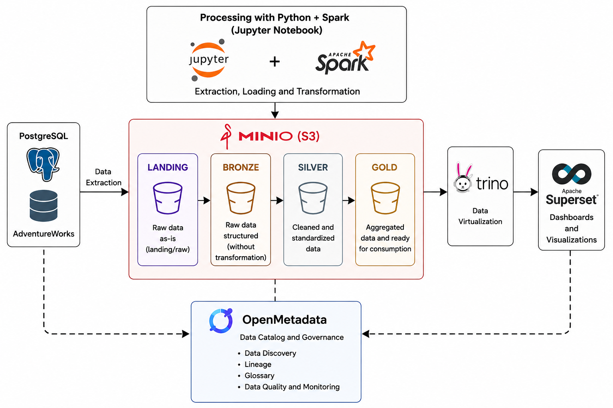
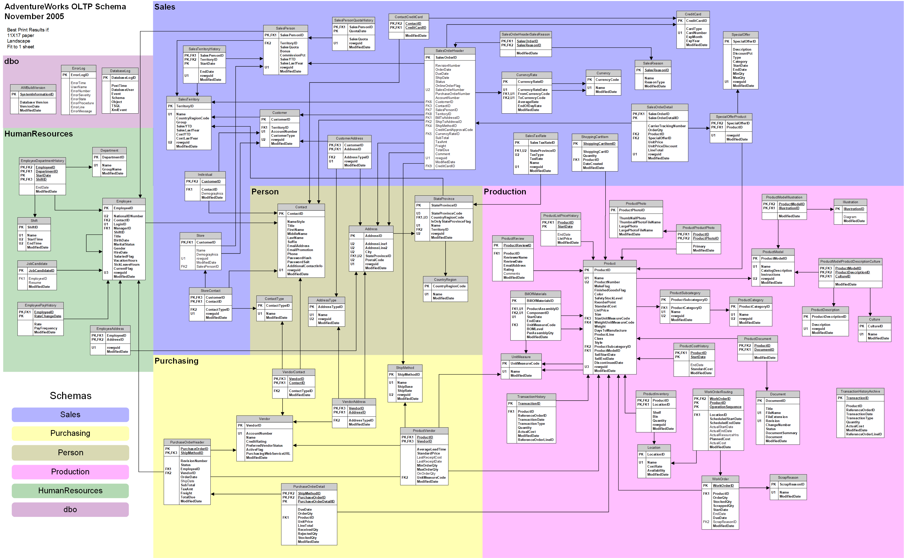

# Project Architecture


## Schema anda relations from PostgreSQL Adventureworks



## Structure from Jupyter notebook
```
src/
└── notebooks
    ├── Examples
    │   ├── 00_hello-spark.ipynb
    │   ├── 01_example_write_delta_table.ipynb
    │   ├── 02_example_read_delta_table.ipynb
    │   ├── 03_time_travel.ipynb
    │   ├── 04_change_data_feed.ipynb
    │   ├── 05_schema_evolution.ipynb
    │   ├── 06_merge_delta_tables.ipynb
    │   ├── 07_spark_sql.ipynb
    │   └── 08_structured_streaming.ipynb
    ├── __init__.py
    ├── configurations
    │   ├── __init__.py
    │   └── configurations.py
    ├── elt
    │   ├── __init__.py
    │   ├── full load
    │   │   ├── 01_full_extract_postgres_to_minio_landing_parquet.ipynb
    │   │   ├── 02_full_load_landing_to_bronze_delta.ipynb
    │   │   ├── 03_full_transform_bronze_to_silver.ipynb
    │   │   ├── 04_full_agregation_silver_to_gold.ipynb
    │   │   └── __init__.py
    │   ├── incremental load
    │   │   ├── 01_incremental_extract_postgresql_to_landing_minio_parquet.ipynb
    │   │   ├── 02_incremental_load_landing_to_bronze_delta.ipynb
    │   │   ├── 03_incremental_transform_bronze_to_silver.ipynb
    │   │   ├── 04_incremental_agregation_silver_to_gold.ipynb
    │   │   └── __init__.py
    ├── functions
    │   ├── __init__.py
    │   └── functions.py
    └── hello_world.py


```

## Notebooks
The notebook directory contains the entire ELT process carried out during the creation of the landing, bronze, silver, and gold layers of the Medallion architecture using Python and Spark with Parquet and Delta file formats.

## notebooks/configurations
The configurations directory contains the paths from MinIO landing, bronze, silver and gold, as well as table names of the postgreSQL tables and Queries in SQL used to create each layer.

## Notebooks/functions
The Functions directory contains the functions used to convert table names, get query from configuration file and add  date about last update in each layer. Provide reusable functions for the notebooks.

## notebooks/examples
The example directory contains jupyter notebooks demonstrate various spark and Delta lake features.