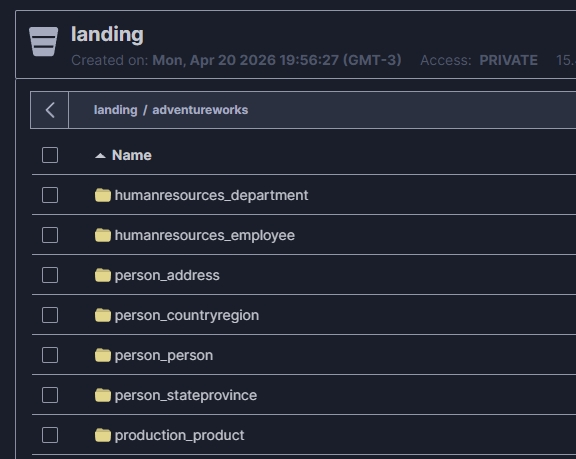

# Conventional names

## Notebooks
```
Example of sctrcuture from file:

(Number_of_script)_(Type of load)_(Process from pipeline)_(Layer/source)_(Target)
```

```
├── 01_full_extract_postgres_to_minio_landing_parquet.ipynb
├── 02_full_load_minio_landing_to_bronze_delta.ipynb
├── 03_full_transform_bronze_to_silver.ipynb
├── 04_full_agregation_silver_to_gold.ipynb
```

## Tables

```
Example of sctrcuture from table name:
(Layer)_(schema)_(name)
```




## Dags

```
Example of sctrcuture from Dag name:
(Layer)_(schema)_(name)
```