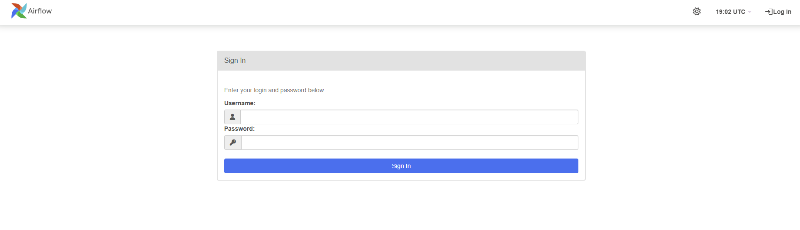

# Apache Airflow

Apache Airflow is an open-source platform used for workflow orchestration, widely popular in data engineering. It allows you to create, schedule, and monitor data pipelines programmatically.

In Airflow, workflows are defined as DAGs (Directed Acyclic Graphs), which represent the sequence and dependencies between tasks. Each task can run scripts, database queries, API integrations, or ETL processes.

Its main strengths are flexibility and scalability, along with a user-friendly web interface for tracking executions, identifying failures, and retrying tasks.