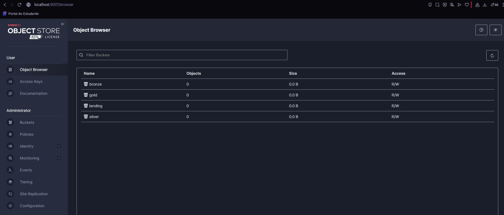

# MinIO

MinIO is a high-performance, open-source object storage solution designed for cloud-native applications. It is fully compatible with the Amazon S3 API, making it easy to integrate with existing tools and workflows. MinIO is optimized for scalability, security, and speed, allowing organizations to efficiently store and manage large volumes of unstructured data such as images, videos, backups, and logs. It is commonly used in data engineering, machine learning, and modern distributed systems.