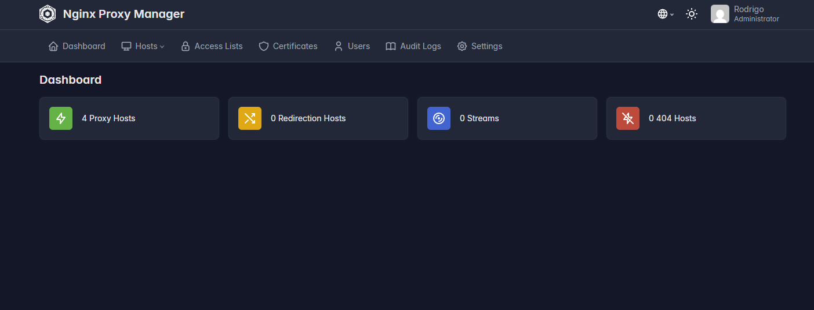

# Nginx Proxy Manager

Nginx Proxy Manager is an easy-to-use, open-source tool that simplifies the management of reverse proxies, SSL certificates, and domain routing. Built on top of NGINX, it provides a clean web-based interface that allows users to configure hosts, manage HTTPS with automatic SSL via Let's Encrypt, and handle traffic routing without deep knowledge of server configuration. It is widely used in containerized environments, such as with Docker, making it ideal for developers who want to efficiently expose and secure their applications.

## To create a Free domain

https://www.duckdns.org

## Docs

https://github.com/NginxProxyManager/nginx-proxy-manager

https://hub.docker.com/r/jc21/nginx-proxy-manager