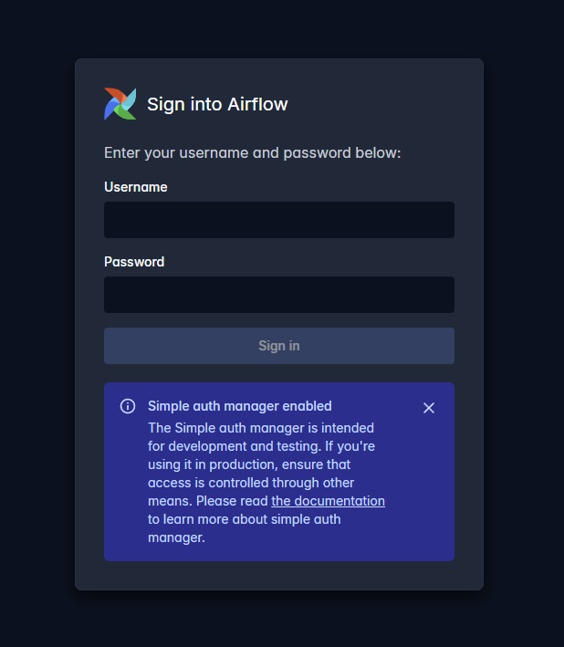

# Open Metadata

Open Metadata UI:

OpenMetadata is an open-source data catalog and metadata management platform designed to improve data discovery, governance, and collaboration across organizations. It enables teams to centralize metadata from multiple data sources, providing a unified view of data assets such as databases, pipelines, dashboards, and machine learning models.

With features like data lineage, data quality monitoring, and role-based access control, OpenMetadata helps ensure data reliability, traceability, and compliance. It also enhances collaboration by allowing users to document, tag, and share insights about data assets, making it easier for both technical and non-technical stakeholders to understand and trust the data.

In this project, OpenMetadata is used to organize and document data assets, ensuring better visibility, governance, and accessibility across the data pipeline.

Airflow UI:

## Ports

Open Metadata Server: 8585

Airflow from Open Metadata: 8087

## Docs

https://docs.open-metadata.org/v1.12.x/deployment/docker