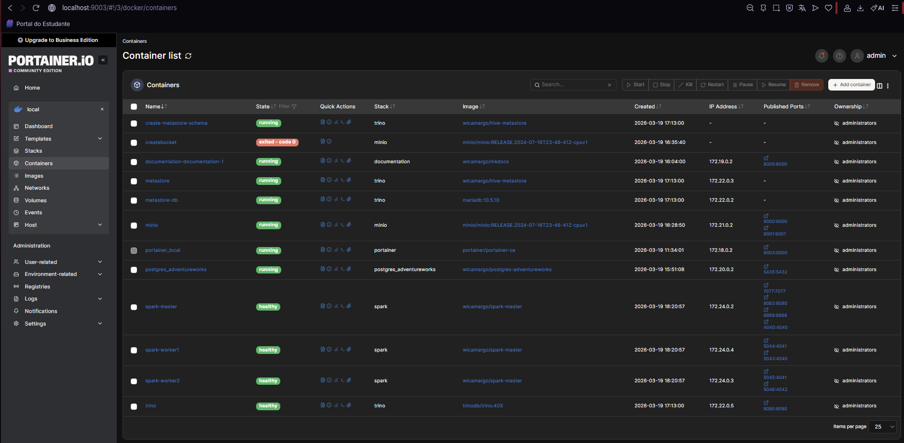

# Portainer

Portainer is a lightweight and user-friendly management tool designed to simplify working with container platforms like Docker and Kubernetes. It provides an intuitive web-based interface that allows users to easily deploy, monitor, and manage containers, images, networks, and volumes without relying solely on command-line operations. Portainer is widely used by both beginners and experienced developers to streamline container management, improve productivity, and reduce complexity in modern application environments.

## Ports

Portainer Server: 9003

## Docs

https://docs.portainer.io/start/install-ce/server/docker/linux#docker-compose