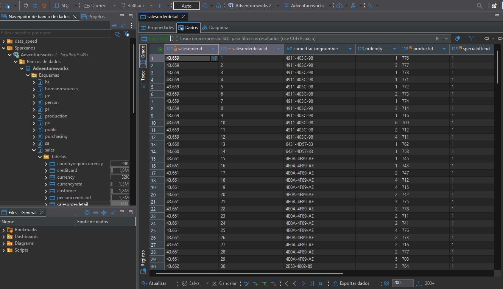

# PostgreSQL

PostgreSQL is a powerful, open-source relational database management system known for its reliability, scalability, and advanced features. It supports complex queries, strong data integrity, and extensibility, making it suitable for a wide range of applications—from small projects to large enterprise systems. PostgreSQL is widely used in data engineering, web development, and analytics due to its performance, robustness, and compliance with SQL standards.

## Ports

PostgreSQL Database: 5435

## Docs (From Docker Hub)

https://hub.docker.com/_/postgres