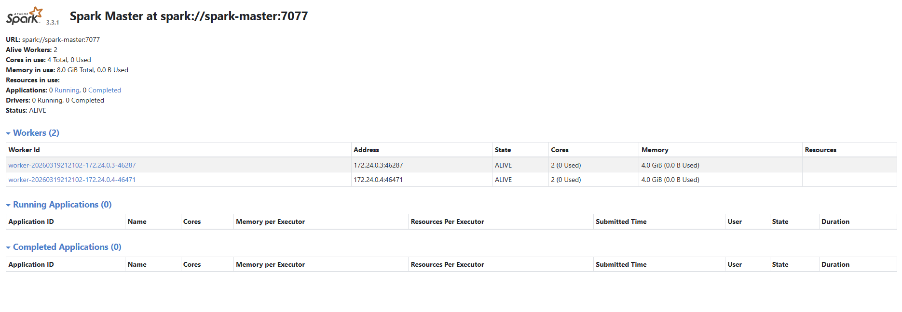

# Apache Spark

Apache Spark is a powerful open-source data processing engine designed for large-scale data analytics. It provides fast, in-memory computation and supports multiple programming languages such as Python, Java, and Scala. Apache Spark is widely used for big data processing, real-time analytics, machine learning, and ETL workflows, making it a key tool in modern data engineering and distributed computing environments.