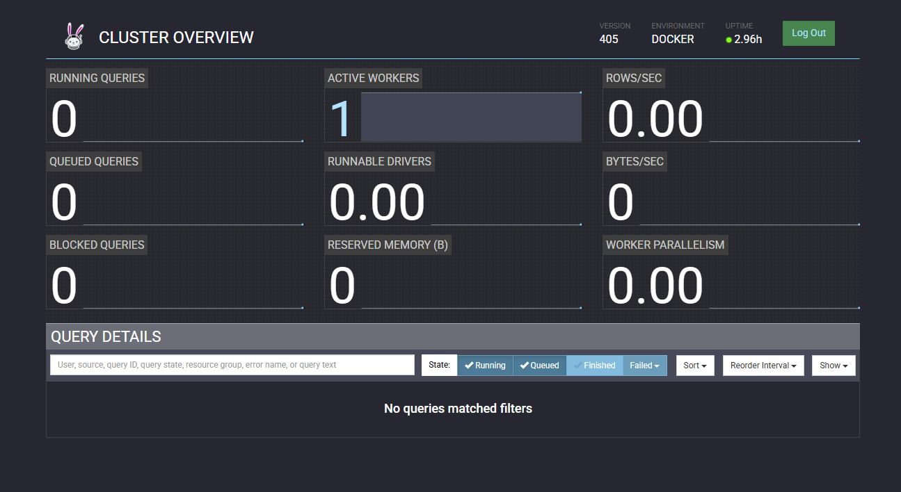

# Trino

Trino is an open-source distributed SQL query engine designed for fast and interactive analytics across multiple data sources. It allows users to query data where it lives—such as databases, data lakes, and cloud storage—without the need for complex data movement. Trino is highly scalable and optimized for performance, making it a popular choice for data engineering, business intelligence, and real-time analytics in modern data architectures.